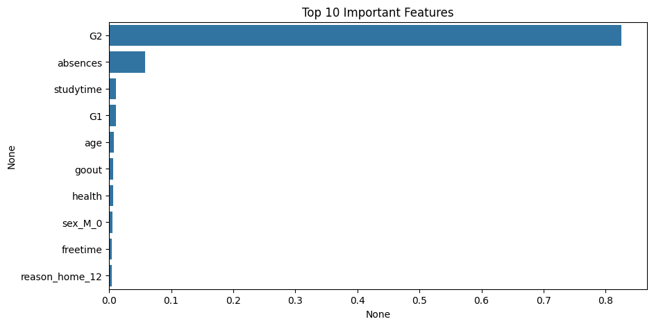

# Student Grade Prediction with Random Forest

This project predicts final student grades (`G3`) using the [UCI Student Performance Dataset](https://archive.ics.uci.edu/ml/datasets/student+performance). It leverages **Random Forest Regressor**, feature engineering, and correlation-based feature selection to build a robust model.

---

## Dataset Description

- Two datasets used:
  - `student-mat.csv` (Mathematics grades)
  - `student-por.csv` (Portuguese grades)
- Each record includes demographic, social, and academic attributes along with three grades (`G1`, `G2`, `G3`).

---

## Tech Stack

- **Python**
- **Pandas**, **NumPy**
- **Matplotlib**, **Seaborn**
- **Scikit-learn**

---

## Project Workflow

1. **Data Loading & Merging**
   - Load both `student-mat.csv` and `student-por.csv`
   - Combine and remove duplicate records

2. **Data Preprocessing**
   - Drop low-importance categorical columns (e.g., `school`, `guardian`)
   - One-Hot Encode categorical variables
   - Normalize features using `StandardScaler`

3. **Feature Selection**
   - Correlation analysis with target variable `G3`
   - Drop features with correlation < 0.05

4. **Modeling**
   - `RandomForestRegressor` with `n_estimators=100`
   - Train-test split: 80/20
   - Evaluate with:
     - Mean Absolute Error (MAE)
     - Root Mean Squared Error (RMSE)
     - R² Score

5. **Model Insights**
   - Visualize top 10 most important features

---

## Results

| Metric | Score |
|--------|-------|
| MAE    | ~`1.1` |
| RMSE   | ~`3.68` |
| R²     | ~`0.76` |

---

## Feature Importance

---

## Key Learnings

- Importance of preprocessing and correlation-based feature filtering
- Handling categorical variables with OneHotEncoder
- Evaluating regression models effectively using multiple metrics
- Interpreting feature importance from ensemble models

---
